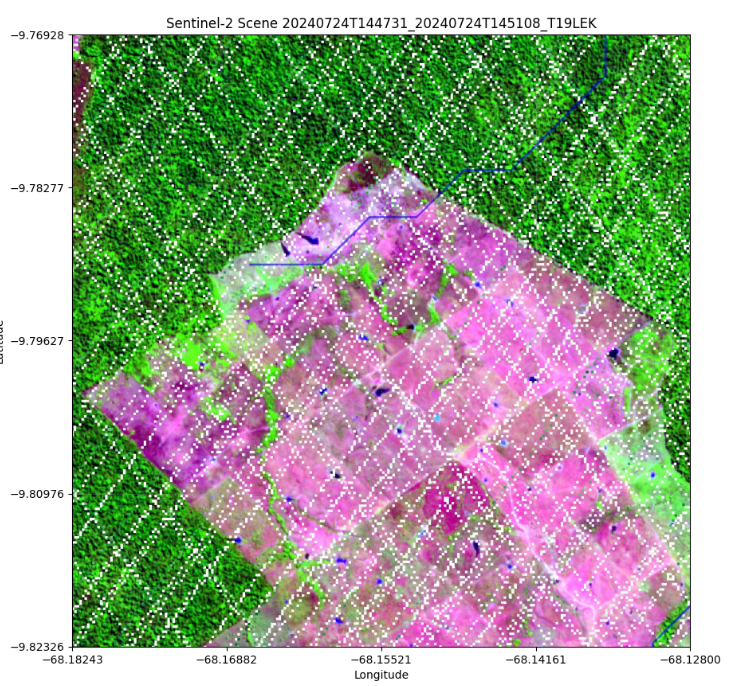

# Amazonia_OpenAItoZ
A Kaggle challenge to bring legends to life by finding previously unknown archaeological site(s), using available open-source data. OpenAI o3/o4 mini and GPT 4.1 models along with Sentinel-2 (Google Earth Engine) were used to discover previously unknown archaeological sites in the Amazonia.


# How to run?
### STEPS:

Clone the repository

```bash
https://github.com/Chatterjee-Arpan/Amazonia_OpenAItoZ.git
```

### STEP 01- Create IAM credentials in Google Cloud to use Earth Engine. You will also require OpenAI API key credentials.

### STEP 02- Run the openai-to-z.ipynb file.
**That's it!**

# The Idea behind



Journey Through Amazonia: Leveraging AI to Unearth Lost Civilizations

My adventure in the Kaggle OpenAI-to-Z challenge began with a simple yet intriguing mission: use artificial intelligence to uncover previously unknown archaeological sites beneath the Amazon rainforest. Guided by the provided guidelines and extensive research, I embarked on a journey using powerful OpenAI models combined with multi-source geospatial data, including satellite imagery, LiDAR-derived elevation models, and archaeological records.

### Checkpoint 1: Initial Anomaly Detection

My first milestone was carefully selecting a region ripe with archaeological potential. Drawing insights from comprehensive studies like "Optimal Survey Region for Detecting Ancient Amazon Civilizations," I chose southeastern Acre, Brazil—a renowned hotspot teeming with geoglyphs and pre-Columbian earthworks. This region, defined between approximately 10.3°S–9.6°S latitude and 68.3°W–67.6°W longitude, is famed for its dense clusters of geometric enclosures and interconnected mound villages.

My thinking process to narrow down to one coordinate was:

* **High-C areas:** Compute soil organic carbon percentiles to mask regions with >5 g C/kg, indicating possible terra preta.

* **Vegetation anomalies:** Extract pixels where NDVI exceeds its 99th percentile within 2 km of major rivers, flagging potential buried ditches or clearings.

* **River proximity:** Select all pixels within 2 km of river geometries to capture settlement-water relationships.

* **Known sites:** Import ArcheoBlog centroids and filter to our survey box as ground-truth candidates.

* **Voting scheme:** Merge all candidate points, annotate each with boolean flags for proximity to soil, NDVI, river, and Archeo features, then sum these flags into a ‘votes’ score.

Final pick: Sort by votes (≥2) and take the top feature—this yields the single seed coordinate that best satisfies multiple archaeological indicators.

Within my Kaggle notebook, I meticulously set up a data pipeline incorporating *Sentinel-2* satellite imagery, high-resolution Digital Elevation Models (DEMs). Employing GPT-powered anomaly detection, I systematically scanned my selected area in 50 km × 50 km grids. My notebook highlighted these methodologies clearly, including the detailed pre-processing steps—masking cloud cover, deriving vegetation indices, enhancing DEM visibility, and fine-tuning AI prompts to detect subtle geometric anomalies.

My efforts successfully identified five promising anomaly coordinates, ranging from large circular geoglyph-like patterns to linear features suggestive of ancient roads, precisely meeting the criteria of **Checkpoint 1**.

### Checkpoint 2: Discovery and Validation

Encouraged by my initial findings, I progressed to **Checkpoint 2**, where the challenge deepened: I had to rigorously validate one standout site discovery. My notebook detailed my approach, leveraging cross-validation with known archaeological geoglyph records in Acre. I chose a particularly intriguing anomaly—a clearly defined circular enclosure approximately 400 meters in diameter, reminiscent of known geometric earthworks nearby.

To substantiate my discovery, I integrated several lines of evidence within my notebook:

* Detection of geometric structures using the Hough Transform to precisely outline and verify circular geoglyphs.

* Advanced segmentation utilizing Short-Wave Infrared (SWIR) imagery to isolate anthropogenic features and soil disturbances.

* **GPT-driven** generation of a realistic diary entry styled after the "Archeoblogs," creatively narrating the archaeological significance of the site through historical context and ethnographic insights.

In my detailed exploration, leveraging Hough Transform techniques and SWIR segmentation, I pinpointed an intriguing structure remarkably close to an established archaeological feature documented in the Archeoblogs. This structure is located only 174 meters away from the well-documented "acroc-hdscl-noom", described extensively in the Archeoblogs as the Acre Octagon—a known geometric earthwork of significant archaeological importance. Specifically, the Archeoblogs mention:

`Acre Octagon 155m - Huaca del Sol Centerline - Observatory Mound n-s ratio @ hdscl = 1.0 : 0.036624 (-1m) epoch hopewell ry = 366.242358 rotations per year Newark Octagon - Huaca del Sol - Acre Octagon 155m nocp-hdsol-acroc n-s ratio @ hdsol = 1.0 : 0.036629 (+17m) epoch hopewell ro = 366.256467 rotations per orbit`

Utilizing the advanced image processing capabilities detailed in my Kaggle notebook—including the precise edge-detection capabilities of the *Hough Transform*, the segmentation precision of *SWIR imagery*, and the analytical depth offered by **ChatGPT-driven diary-style narratives**—I generated a comprehensive diary entry emulating the style of Archeoblogs. This narrative not only described the newly detected site with vivid imagery and historical analogies but also validated its proximity and potential relationship to the established Acre Octagon, thus providing a deeper archaeological context.

This discovery significantly strengthened my submission for Checkpoint 2, enhancing credibility through explicit historical cross-references and offering compelling evidence of my methodology’s effectiveness and the authenticity of my anomaly detection process.

The Narrative: From Data to Discovery

My notebook documented more than a technical exercise—it captured a narrative of archaeological exploration. Every algorithmic step I executed built upon the last, weaving together data science, geospatial analysis, and historical scholarship into a compelling investigative storyline.

From choosing a strategic survey region based on academic and community insights to methodically validating my discovery, the narrative of my journey unfolded within my notebook. Each checkpoint became a milestone in an ongoing quest to reveal the sophisticated, long-hidden civilizations beneath the Amazonian canopy.

Thank you, everyone!

References:
*[OpenAItoZ](https://www.kaggle.com/competitions/openai-to-z-challenge)
*[The ArchaeoBlog](https://www.jqjacobs.net/blog/)
